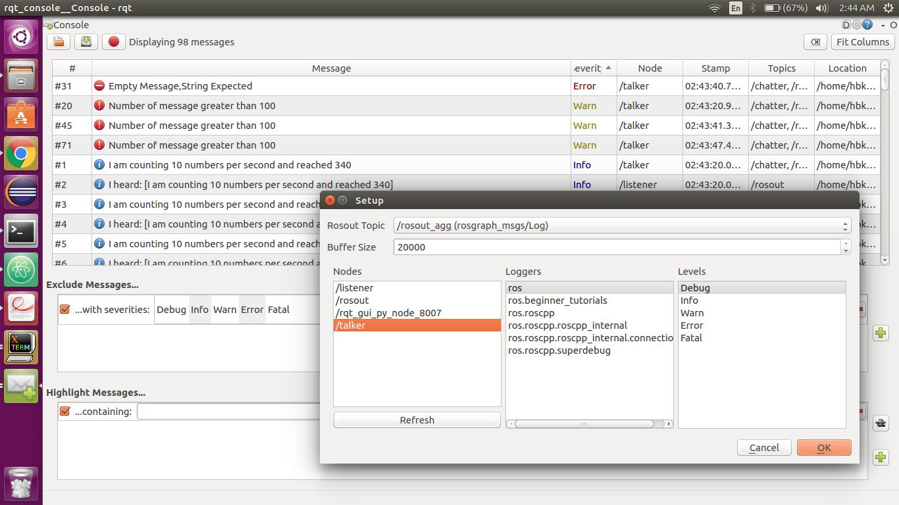
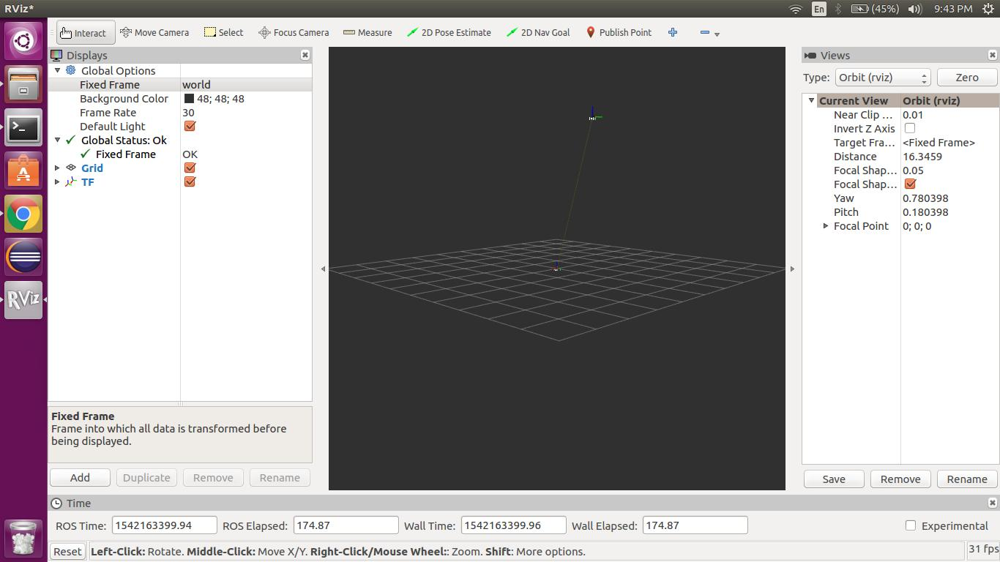
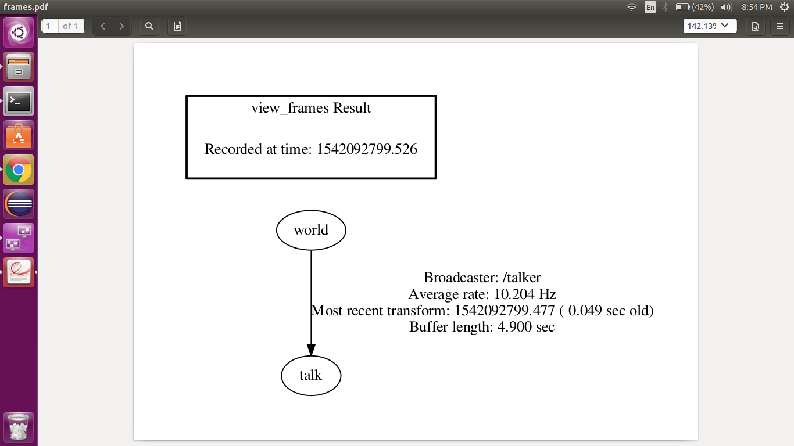

# beginner_tutorials
[](https://github.com/harshkakashaniya/beginner_tutorials/blob/master/LICENSE)

## Overview

A small project of ROS to understand basic concepts of nodes, topic etc. By taking an example of publisher (i.e in our case Talker) and Subscriber(i.e in our case Listener). This project teaches how to write code for Publisher and Subscriber. At the end we will also use rosrun command and make two nodes which will enable us to communicate.
Later we learned about Log messages there different level. Also we learned to make service server and client. Using this service we changes string of talker. Also we learned about concept of launch file and made one to automate our listener and talker.
Later we learned concept of Bag file for storing data which can be used as may time we require for virtual simulation of robot. Then we learned about the google tests to be used for testing nodes and services at the end we learned about the tf frames and its applications. So all this learning is done with examples inside the code. So every concept learned has an application in this project.

## License
```
MIT License

Copyright (c) 2018 Harsh Kakashaniya

Permission is hereby granted, free of charge, to any person obtaining a copy
of this software and associated documentation files (the "Software"), to deal
in the Software without restriction, including without limitation the rights
to use, copy, modify, merge, publish, distribute, sublicense, and/or sell
copies of the Software, and to permit persons to whom the Software is
furnished to do so, subject to the following conditions:

The above copyright notice and this permission notice shall be included in all
copies or substantial portions of the Software.

THE SOFTWARE IS PROVIDED "AS IS", WITHOUT WARRANTY OF ANY KIND, EXPRESS OR
IMPLIED, INCLUDING BUT NOT LIMITED TO THE WARRANTIES OF MERCHANTABILITY,
FITNESS FOR A PARTICULAR PURPOSE AND NONINFRINGEMENT. IN NO EVENT SHALL THE
AUTHORS OR COPYRIGHT HOLDERS BE LIABLE FOR ANY CLAIM, DAMAGES OR OTHER
LIABILITY, WHETHER IN AN ACTION OF CONTRACT, TORT OR OTHERWISE, ARISING FROM,
OUT OF OR IN CONNECTION WITH THE SOFTWARE OR THE USE OR OTHER DEALINGS IN THE
SOFTWARE.
```

## Dependencies
### Install ROS
ROS should be installed on the system. This package is tested on Ubuntu 16.04 LTS with [ROS Kinetic Distribution](http://wiki.ros.org/kinetic).
Installation Instructions can be found [here](http://wiki.ros.org/kinetic/Installation).

### Install catkin
catkin is a Low-level build system macros and infrastructure for ROS.
catkin is included by default when ROS is installed. But, it can also be installed with apt-get

```
sudo apt-get install ros-kinetic-catkin
```

### Creating a catkin workspace
Create a catkin workspace using following instructions:
```
$ mkdir -p ~/catkin_ws/src
$ cd ~/catkin_ws/src
$ git clone --recursive https://github.com/harshkakashaniya/beginner_tutorials/ --branch Week11_HW
$ catkin_create_pkg beginner_tutorials
```
### Build the program
```
cd ~/catkin_ws
catkin_make
```
catkin_make works as cmake and make of our Cmake process. After running this we will see two more folders named build and devel

### Run the program

## In Terminal 1
```
roscore
```
## In Terminal 2
Here 20 is the required frequency it can be any positive value <frequrncy value>
If no argument given it will take default frequency which is 10 Hz.
```
cd ~/catkin_ws
source devel/setup.bash
rosrun beginner_tutorials talker 50
```

## This is output of Publisher


## In Terminal 3
```
cd ~/catkin_ws
source devel/setup.bash
rosrun beginner_tutorials listener
```
## This is output of Subscriber


## Logger Level
These are logs which will come in different situation of input.
## 1.Debug
```
[DEBUG] [1541559045.561792034]:Frequency set to 10 Hz
```
## 2.Info
```
[ INFO] [1541558611.011847575]: I am counting 10 numbers per second and reached 5
```
## 3.Warn
When counter goes above 100 messages.
```
[ WARN] [1541558608.512518802]: Number of message greater than 100
```
## 4.Error
When service passes Empty string.
```
[ERROR] [1541559281.905413291]: Empty Message,String Expected
```
## 5. Fatal
When given frequency < 0 (negative frequency)
```
[FATAL] [1541558543.617456555]: Frequency given is negative.Changefrequency to positive
```

## Launch File
```
cd ~/catkin_ws
source devel/setup.bash
roslaunch beginner_tutorials two_nodes.launch Frequency:=30
```
<Frequency value to be passed>=30 in this case we can change it.
Note: Without argument it will give Error

## Service File
This service is made to change string which is printed by talker.

To check service names available
```
rosservice list
```
If everything is fine you will see as one of the service as
```
/change_string
```
To run the service
```
cd ~/catkin_ws
source devel/setup.bash
rosservice call /change_string 'New message to type'
```

## RQT Console and Logger level
To open logger
```
rqt_logger_level
```
To open RQT console
```
 rqt_console
```
Sample of Console and Logger level



## TF frames 
We edited talker to broadcast transfer function. So first run the node
```
cd ~/catkin_ws
source devel/setup.bash
rosrun beginner_tutorials talker
```
In other terminal
```
cd ~/catkin_ws
source devel/setup.bash
rosrun tf tf_echo /world /talk
```
We can see the significance of the values printed by tf_echo by following code.
```
rviz
```
on left select frame fixed to be world
and at bottom
```
click ADD
Select TF from the list
```
Following will be the output


tf_echo will show us the output of moving frame.
Output can be checked in rqt_tf_tree to see the /world and /talk frame  
```
rosrun rqt_tf_tree rqt_tf_tree
```
Such output is desirable.



```
rosrun tf view_frames
```
will save the pdf at that terminal address of same output as above.

## Running rostest
Level 2 integration test is written for checking service of String change and can be build and tested by following code. 
```
cd ~/catkin_ws
catkin_make tests
catkin_make test
```
OR
```
cd ~/catkin_ws
source devel/setup.bash
catkin_make tests
rostest beginner_tutorials test.launch
```
Output
```
[ROSUNIT] Outputting test results to /home/hbk/.ros/test_results/beginner_tutorials/rostest-test_test.xml
[Testcase: testtalkTest] ... ok

[ROSTEST]-----------------------------------------------------------------------

[beginner_tutorials.rosunit-talkTest/testInitOfService][passed]

SUMMARY
 * RESULT: SUCCESS
 * TESTS: 1
 * ERRORS: 0
 * FAILURES: 0

```
## Recording bag files with the launch file,
```
cd ~/catkin_ws
source devel/setup.bash
roslaunch beginner_tutorials two_nodes.launch Record:=true
```
by this command we will have RecordTalker.bag file in result folder. One such sample file is kept in result/RosbagRecording.bag
## Disable bag file recording,
To Disable bag file recording, come to terminal
```
Press Ctrl+C 
```
## Inspecting the bag file
to check what are the details of any particular bag file.
```
cd ~/catkin_ws
rosbag info src/beginner_tutorials/results/RosbagRecording.bag

```
We will see similar ouput
```
path:        src/beginner_tutorials/results/RosbagRecording.bag
version:     2.0
duration:    15.9s
start:       Nov 13 2018 18:20:40.28 (1542151240.28)
end:         Nov 13 2018 18:20:56.18 (1542151256.18)
size:        135.6 KB
messages:    641
compression: none [1/1 chunks]
types:       rosgraph_msgs/Log  [acffd30cd6b6de30f120938c17c593fb]
             std_msgs/String    [992ce8a1687cec8c8bd883ec73ca41d1]
             tf2_msgs/TFMessage [94810edda583a504dfda3829e70d7eec]
topics:      /chatter      156 msgs    : std_msgs/String   
             /rosout       166 msgs    : rosgraph_msgs/Log  (2 connections)
             /rosout_agg   162 msgs    : rosgraph_msgs/Log 
             /tf           157 msgs    : tf2_msgs/TFMessage
```


## Playing back the bag file with the Listener node demonstration.
```
cd ~/catkin_ws
source devel/setup.bash
rosrun beginner_tutorials listener
```
In other terminal
```
cd ~/catkin_ws
cd src/beginner_tutorials/
rosbag play results/RosbagRecording.bag
```
Similar is the output of Rosbag when the above code is run.
```
[RUNNING]  Bag Time: 1542151242.383368   Duration: 2.108356 / 15.907971       
[RUNNING]  Bag Time: 1542151242.383678   Duration: 2.108666 / 15.907971
[RUNNING]  Bag Time: 1542151242.483401   Duration: 2.208389 / 15.907971     
[RUNNING]  Bag Time: 1542151242.483769   Duration: 2.208757 / 15.907971      
[RUNNING]  Bag Time: 1542151242.583377   Duration: 2.308366 / 15.907971      
[RUNNING]  Bag Time: 1542151242.583748   Duration: 2.308736 / 15.907971       
[RUNNING]  Bag Time: 1542151242.683448   Duration: 2.408437 / 15.907971  
[RUNNING]  Bag Time: 1542151242.683716   Duration: 2.408705 / 15.907971   
[RUNNING]  Bag Time: 1542151242.783114   Duration: 2.508102 / 15.907971    
[RUNNING]  Bag Time: 1542151242.883425   Duration: 2.608414 / 15.907971   
[RUNNING]  Bag Time: 1542151242.883842   Duration: 2.608830 / 15.907971    
[RUNNING]  Bag Time: 1542151242.983378   Duration: 2.708366 / 15.907971     
[RUNNING]  Bag Time: 1542151242.983547   Duration: 2.708535 / 15.907971     
[RUNNING]  Bag Time: 1542151242.983651   Duration: 2.708640 / 15.907971  
[RUNNING]  Bag Time: 1542151243.083310   Duration: 2.808298 / 15.907971  
[RUNNING]  Bag Time: 1542151243.083660   Duration: 2.808648 / 15.907971  
[RUNNING]  Bag Time: 1542151243.083922   Duration: 2.808910 / 15.907971   
[RUNNING]  Bag Time: 1542151243.183209   Duration: 2.908197 / 15.907971   
[RUNNING]  Bag Time: 1542151243.183272   Duration: 2.908261 / 15.907971   
[RUNNING]  Bag Time: 1542151243.183444   Duration: 2.908432 / 15.907971    
[RUNNING]  Bag Time: 1542151243.283300   Duration: 3.008288 / 15.907971    
[RUNNING]  Bag Time: 1542151243.283487   Duration: 3.008475 / 15.907971 
```
Output of listener as bag file is working.
```
[ INFO] [1542162511.817888162]: I heard: [I am counting 10 numbers per second and reached 72]
[ INFO] [1542162511.917725885]: I heard: [I am counting 10 numbers per second and reached 73]
[ INFO] [1542162512.017774180]: I heard: [I am counting 10 numbers per second and reached 74]
[ INFO] [1542162512.117828360]: I heard: [I am counting 10 numbers per second and reached 75]
[ INFO] [1542162512.217753275]: I heard: [I am counting 10 numbers per second and reached 76]
[ INFO] [1542162512.317813769]: I heard: [I am counting 10 numbers per second and reached 77]
[ INFO] [1542162512.418080831]: I heard: [I am counting 10 numbers per second and reached 78]
[ INFO] [1542162512.517941984]: I heard: [I am counting 10 numbers per second and reached 79]
[ INFO] [1542162512.617787305]: I heard: [I am counting 10 numbers per second and reached 80]
[ INFO] [1542162512.717960719]: I heard: [I am counting 10 numbers per second and reached 81]
[ INFO] [1542162512.817748357]: I heard: [I am counting 10 numbers per second and reached 82]
```

## Termination
Press Ctrl+C in all the terminals to close the running program.

## OR

In new terminal type
```
rosnode kill talker
rosnode kill listener
```
