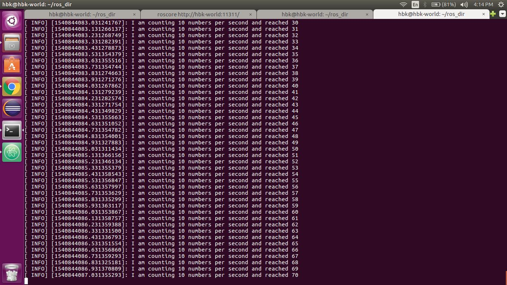
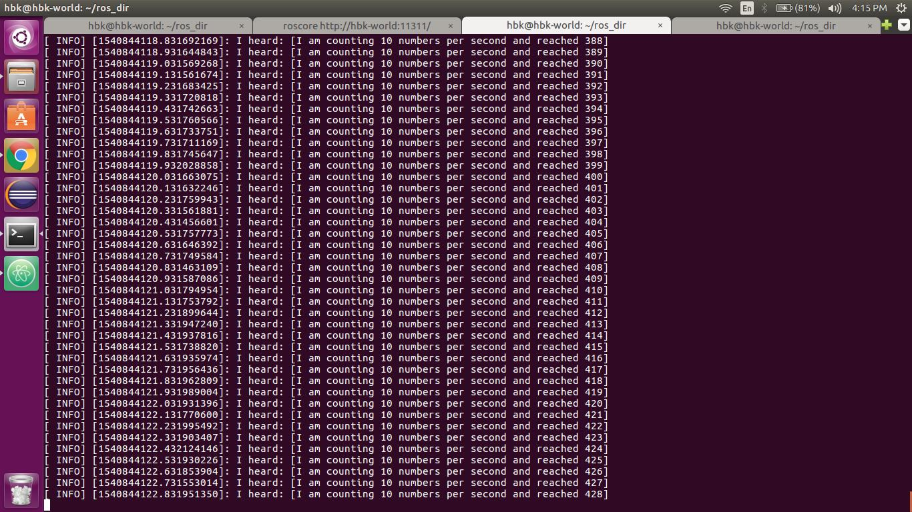

# beginner_tutorials
[](https://github.com/harshkakashaniya/beginner_tutorials/blob/master/LICENSE)

## Overview

A small project of ROS to understand basic concepts of nodes, topic etc. By taking an example of publisher (i.e in our case Talker) and Subscriber(i.e in our case Listener). This project teaches how to write code for Publisher and Subscriber. At the end we will also use rosrun command and make two nodes which will enable us to communicate.

This will generates a output as follows

## This is output of Publisher


## This is output of Subscriber



## License
```
MIT License

Copyright (c) 2018 Harsh Kakashaniya

Permission is hereby granted, free of charge, to any person obtaining a copy
of this software and associated documentation files (the "Software"), to deal
in the Software without restriction, including without limitation the rights
to use, copy, modify, merge, publish, distribute, sublicense, and/or sell
copies of the Software, and to permit persons to whom the Software is
furnished to do so, subject to the following conditions:

The above copyright notice and this permission notice shall be included in all
copies or substantial portions of the Software.

THE SOFTWARE IS PROVIDED "AS IS", WITHOUT WARRANTY OF ANY KIND, EXPRESS OR
IMPLIED, INCLUDING BUT NOT LIMITED TO THE WARRANTIES OF MERCHANTABILITY,
FITNESS FOR A PARTICULAR PURPOSE AND NONINFRINGEMENT. IN NO EVENT SHALL THE
AUTHORS OR COPYRIGHT HOLDERS BE LIABLE FOR ANY CLAIM, DAMAGES OR OTHER
LIABILITY, WHETHER IN AN ACTION OF CONTRACT, TORT OR OTHERWISE, ARISING FROM,
OUT OF OR IN CONNECTION WITH THE SOFTWARE OR THE USE OR OTHER DEALINGS IN THE
SOFTWARE.
```

## Dependencies
### Install ROS
ROS should be installed on the system. This package is tested on Ubuntu 16.04 LTS with [ROS Kinetic Distribution](http://wiki.ros.org/kinetic).
Installation Instructions can be found [here](http://wiki.ros.org/kinetic/Installation).

### Install catkin
catkin is a Low-level build system macros and infrastructure for ROS.
catkin is included by default when ROS is installed. But, it can also be installed with apt-get

```
sudo apt-get install ros-kinetic-catkin
```

### Creating a catkin workspace
Create a catkin workspace using following instructions:
```
$ mkdir -p ~/catkin_ws/src
$ cd ~/catkin_ws/src
$ git clone https://github.com/harshkakashaniya/beginner_tutorials
$ catkin_create_pkg beginner_tutorials
```
### Build the program
```
cd ~/catkin_ws
catkin_make
```
catkin_make works as cmake and make of our Cmake process. After running this we will see two more folders named build and devel

### Run the program

## In Terminal 1
```
roscore
```
## In Terminal 2
```
cd ~/catkin_ws
source devel.setup.bash
rosrun beginner_tutorials talker
```
## In Terminal 3
```
cd ~/catkin_ws
source devel.setup.bash
rosrun beginner_tutorials listener 
```
## Termination
Press Ctrl+C in all the terminals to close the running program.
## OR

In new terminal type
```
rosnode kill talker
rosnode kill listener 
```
